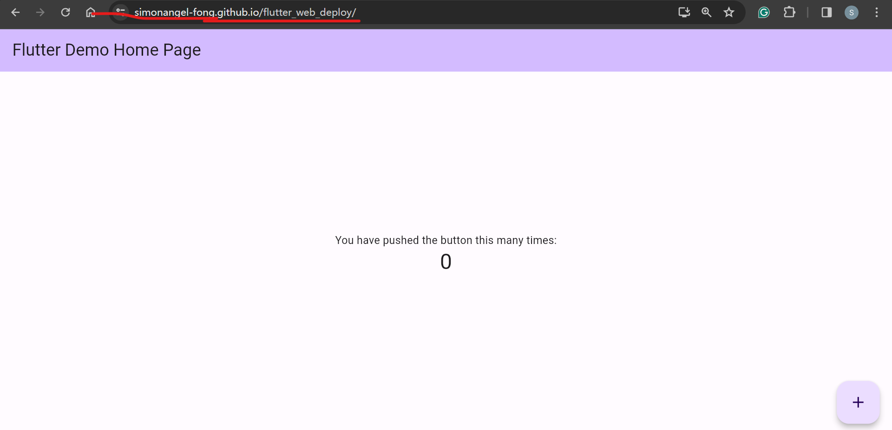
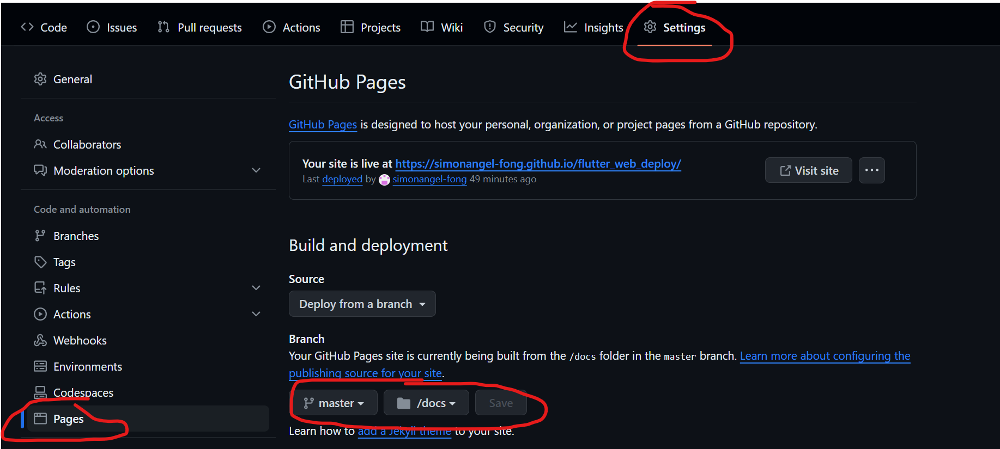

# flutter_web_deploy

A repo for testing deploy flutter web app

- [flutter\_web\_deploy](#flutter_web_deploy)
  - [Deployment](#deployment)
    - [Test for flutter app Link](#test-for-flutter-app-link)
  - [Steps:](#steps)
    - [Enable GitHub Page](#enable-github-page)
    - [Build Locally](#build-locally)
    - [Test Release Locally](#test-release-locally)
    - [Push and Deploy](#push-and-deploy)
  - [Problem](#problem)
  - [Renders](#renders)
    - [`html` Renderer](#html-renderer)
    - [`canvaskit` Renderer](#canvaskit-renderer)

---

## Deployment

- Deployment Options

  - **GitHub Page**
  - AWS S3
  - Google Web hosting
  - ...

- Choose: `GitHub`

  - Benefit:
    - budget requirement, **free**
    - less requirements for **maintenance**.
      - e.g., AWS or GCP need additional skills.
    - **Integrate** with GitHub repo.
    - capable for **developement stage**.
  - Limitations:
    - less scalibility, compared with Cloud service providers, such AWS or GCP.

- Ref:

  - [Building a web application with Flutter](https://docs.flutter.dev/platform-integration/web/building)
  - [Hosting a Flutter Web Project on GitHub Pages](https://medium.com/@aravinthc18/hosting-a-flutter-web-project-on-github-pages-473474bd0c6f)
  - [Simple Way to deploy a Flutter Web Application on GitHub](https://flutterawesome.com/simple-way-to-deploy-a-flutter-web-application-on-github/)

---

### Test for flutter app Link

- **available for Flutter Web App**
  - https://simonangel-fong.github.io/flutter_web_deploy/



---

## Steps:

### Enable GitHub Page

- **GitHub owner** creates a GitHub repo for deployment.(refer it as `deploy_repo`)
- Enable GitHub Page
  - Setting>Page>Build and deployment>Branch
  - Select `master` and `/docs`
  - Click `Save`



---

### Build Locally

- Develope and test the app locally
- Build the release locally

```sh
# clean the build
flutter clean
flutter build web
# This command will generate a release build,
# populate a build/web directory with built files, including an assets directory, which need to be served together.
# flutter build web --base-href /<project-name>/
```

---

### Test Release Locally

- official ref:
  - [Build and release a web app](https://docs.flutter.dev/deployment/web#deploying-to-the-web)
- navigate to the `/build/web`
- Launch a web server

```py
python -m http.server 8000
```

- Test in browser

```text
localhost:8000
```


---

### Push and Deploy

- Copy the files in the `/build/web` to the root of `deploy_repo` repo.
- Commit and push `deploy_repo`.

  - GitHub Page will automatically deploy.

- Test for our project
  - https://simonangel-fong.github.io/flutter_web_deploy_demo/


---

## Problem

- Some widgets cannot render as expected.
- Possible reasons:
  - renderers: no
  - some widgets are not capable for html

## Renders

- Renders:

  - `html`: default, use the `HTML` renderer
  - `canvaskit`: use the `CanvasKit` renderer

- ref: https://docs.flutter.dev/platform-integration/web/renderers

---

### `html` Renderer

- Build release

```sh
flutter build web --web-renderer html
```

- Test result:
  - not work

---

### `canvaskit` Renderer

- Build release

```sh
flutter build web --web-renderer canvaskit
```

- Test result:
  - not work

---

[TOP](#flutter_web_deploy)
