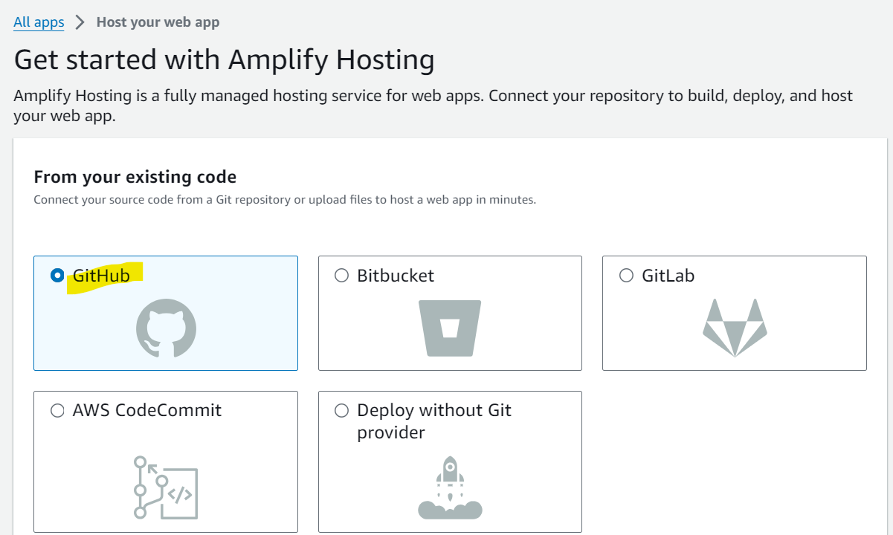
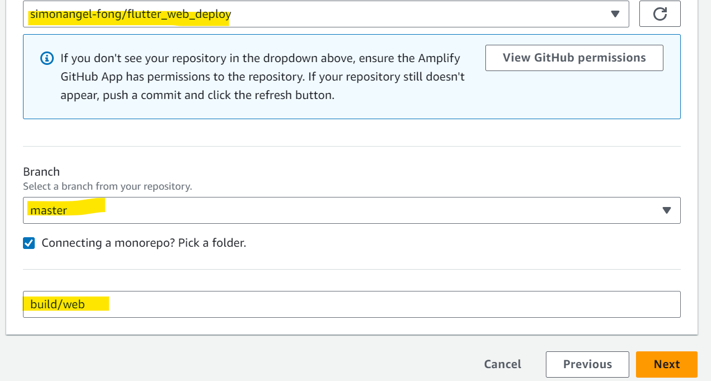
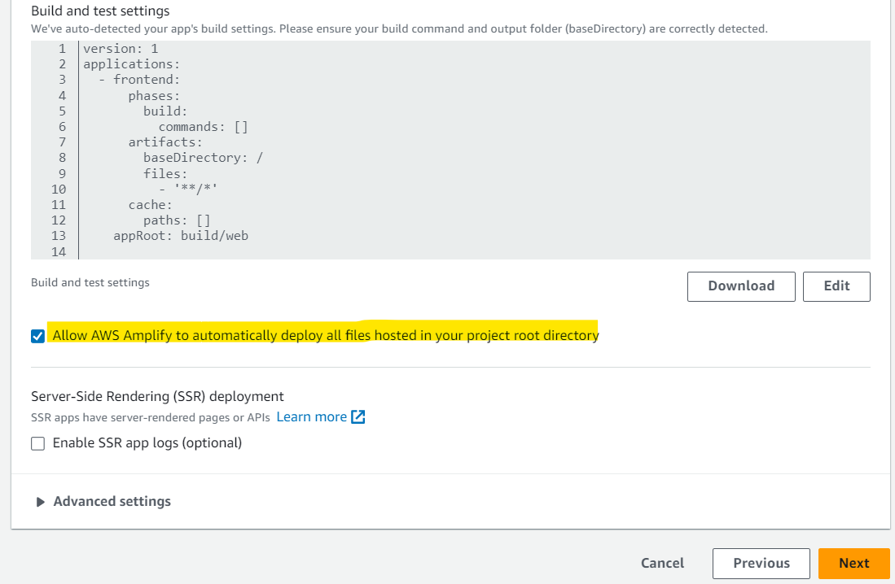
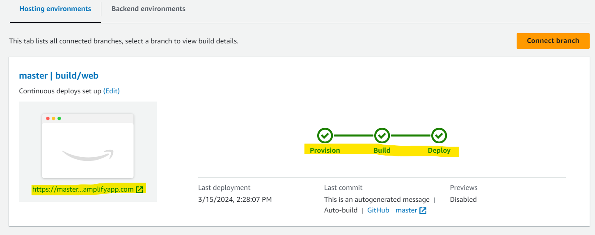
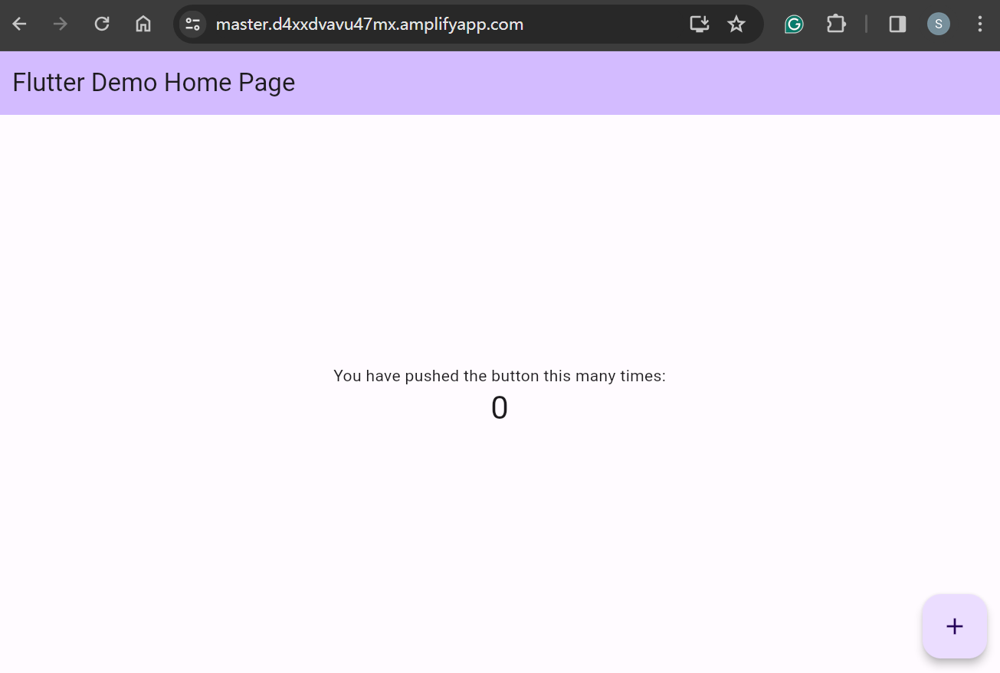
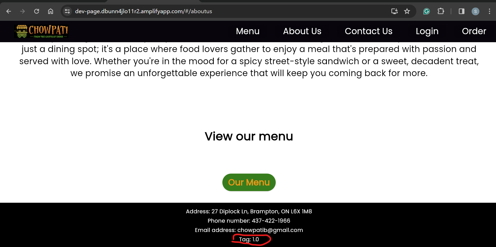

# Deployment - AWS Amplify

[Back](../../README.md)

- [Deployment - AWS Amplify](#deployment---aws-amplify)
  - [AWS Amplify](#aws-amplify)
    - [Test for Capstone](#test-for-capstone)
    - [Test for CICD](#test-for-cicd)

---

## AWS Amplify

- Push to GitHub
- Setup Amplify Hosting

- Add GitHub repo
  - specify dir for build

- Build settings
  - allow all files hosted in project root directory

- Complete

- Test
  - https://master.d4xxdvavu47mx.amplifyapp.com/

---

### Test for Capstone

- url:
  - https://dev-page.dbunn4jlo11r2.amplifyapp.com/

---

### Test for CICD

---

[TOP](#deployment---aws-amplify)
