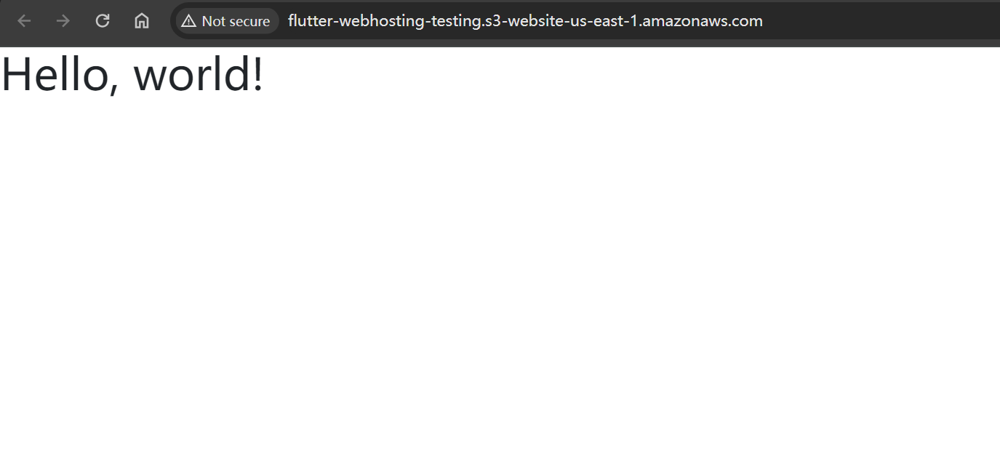
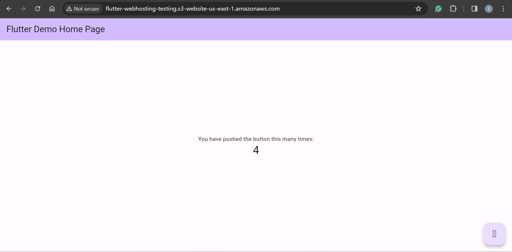

# Deployment - AWS S3

[Back](../../README.md)

---

## Create a S3 bucket

- Enable static web hosting
- Url:
  - http://flutter-webhosting-testing.s3-website-us-east-1.amazonaws.com/



---

## Build and Upload

```sh
flutter clean

flutter build web
# flutter build web --web-renderer canvaskit
# flutter build web --base-href /flutter_web_deploy/      # not working
```

---

- Widget cannot render



---

[TOP](#deployment---aws-s3)
