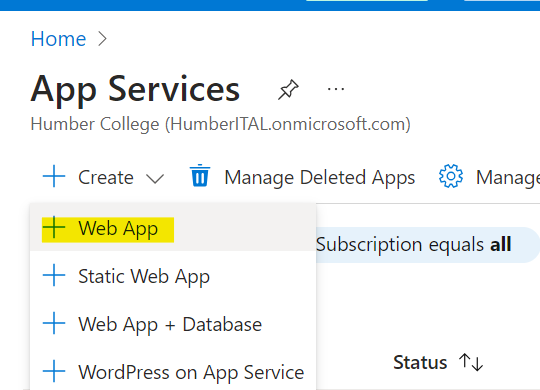
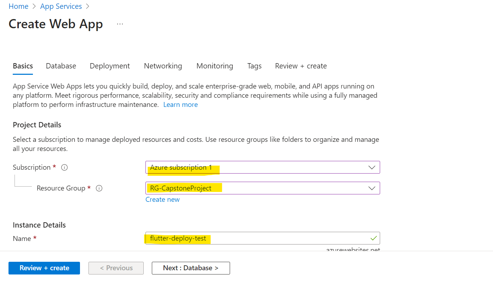
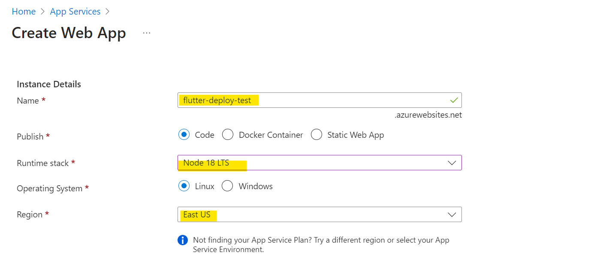
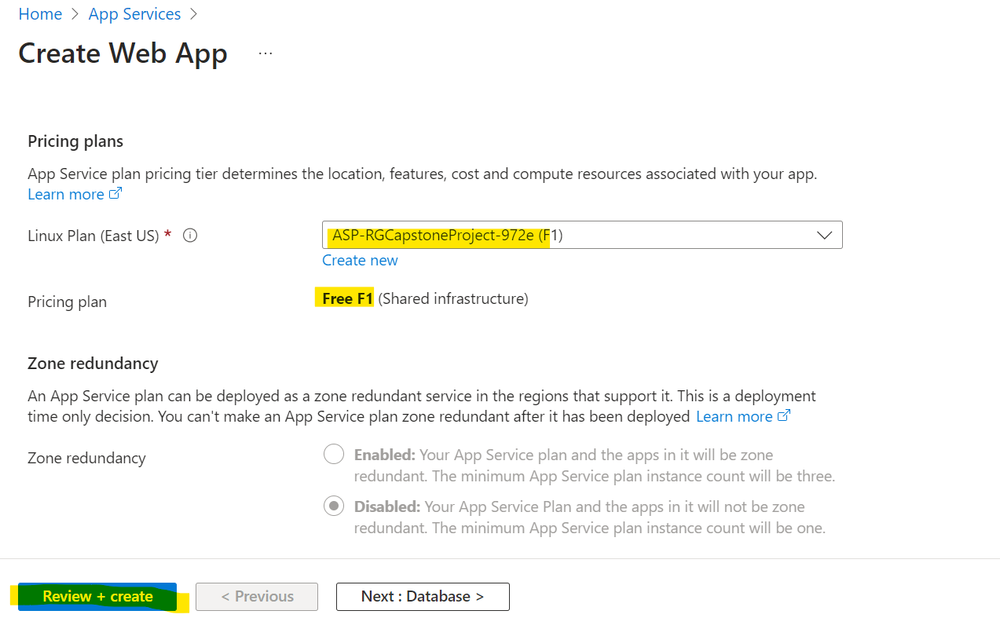
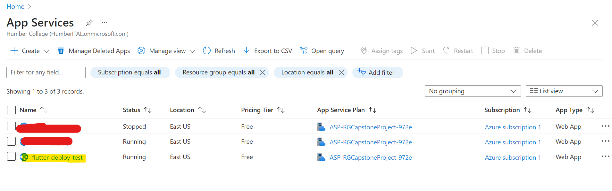
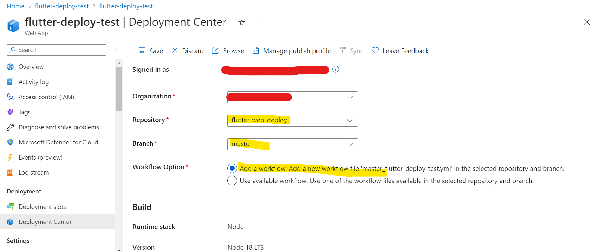
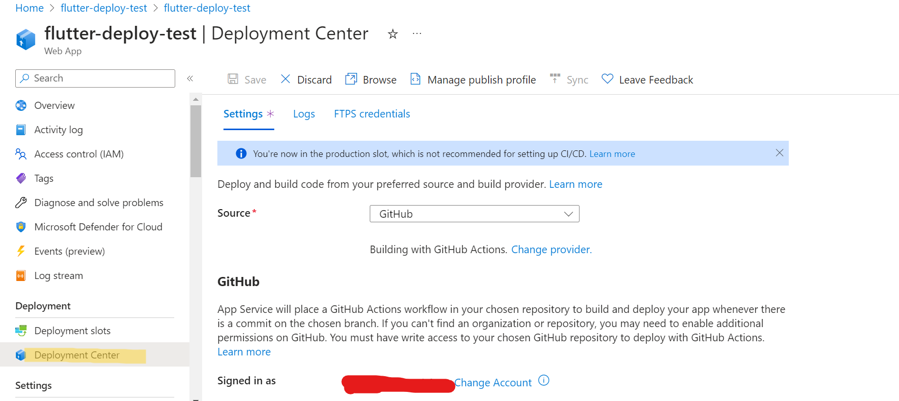
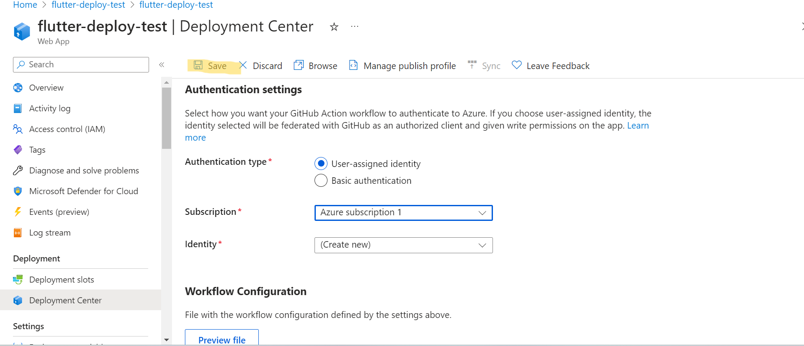

# Flutter Web Deployment - Azure

[Back](../../README.md)

- [Flutter Web Deployment - Azure](#flutter-web-deployment---azure)
  - [Create and Develope Flutter Web App](#create-and-develope-flutter-web-app)
  - [Add `Node.js` configuration files](#add-nodejs-configuration-files)
  - [Create an Azure App Services](#create-an-azure-app-services)

---

- ref:
  - https://www.showwcase.com/article/34739/flutter-web-app-to-azure-app-service-with-node-js

## Create and Develope Flutter Web App

---

## Add `Node.js` configuration files

- Dependences
  - `package.json`

```json
{
  "name": "counter-app-flutter",
  "version": "0.0.0",
  "private": true,
  "scripts": {
    "start": "node ./bin/www"
  },
  "dependencies": {
    "cookie-parser": "~1.4.4",
    "debug": "~2.6.9",
    "express": "~4.16.1",
    "http-errors": "~1.6.3",
    "jade": "~1.11.0",
    "morgan": "~1.9.1"
  }
}
```

---

- `app.js`

```js
var express = require("express");
var path = require("path");
var cookieParser = require("cookie-parser");
var logger = require("morgan");

var app = express();

app.use(logger("dev"));
app.use(express.json());
app.use(express.urlencoded({ extended: false }));
app.use(cookieParser());
app.use(express.static(path.join(__dirname, "build", "web")));

module.exports = app;
```

---

- `/bin/www`

```js
#!/usr/bin/env node

/**
 * Module dependencies.
 */

var app = require("../app");
var debug = require("debug")("counter-app-flutter:server");
var http = require("http");

/**
 * Get port from environment and store in Express.
 */

var port = normalizePort(process.env.PORT || "3000");
app.set("port", port);

/**
 * Create HTTP server.
 */

var server = http.createServer(app);

/**
 * Listen on provided port, on all network interfaces.
 */

server.listen(port);
server.on("error", onError);
server.on("listening", onListening);

/**
 * Normalize a port into a number, string, or false.
 */

function normalizePort(val) {
  var port = parseInt(val, 10);

  if (isNaN(port)) {
    // named pipe
    return val;
  }

  if (port >= 0) {
    // port number
    return port;
  }

  return false;
}

/**
 * Event listener for HTTP server "error" event.
 */

function onError(error) {
  if (error.syscall !== "listen") {
    throw error;
  }

  var bind = typeof port === "string" ? "Pipe " + port : "Port " + port;

  // handle specific listen errors with friendly messages
  switch (error.code) {
    case "EACCES":
      console.error(bind + " requires elevated privileges");
      process.exit(1);
      break;
    case "EADDRINUSE":
      console.error(bind + " is already in use");
      process.exit(1);
      break;
    default:
      throw error;
  }
}

/**
 * Event listener for HTTP server "listening" event.
 */

function onListening() {
  var addr = server.address();
  var bind = typeof addr === "string" ? "pipe " + addr : "port " + addr.port;
  debug("Listening on " + bind);
}
```

---

## Create an Azure App Services









