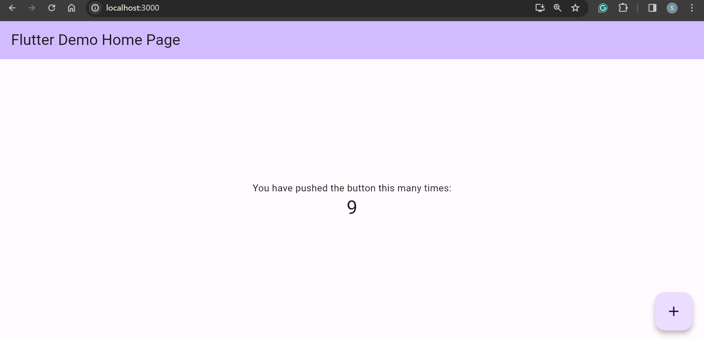

# Flutter Web App Deployment - Node.js Server (Local)

[Back](../../README.md)

- [Flutter Web App Deployment - Node.js Server (Local)](#flutter-web-app-deployment---nodejs-server-local)
  - [Create, Develope a Flutter Web Application](#create-develope-a-flutter-web-application)
  - [Configure Node.js Environment](#configure-nodejs-environment)
    - [Install dependencies](#install-dependencies)
  - [Copy Flutter Build files](#copy-flutter-build-files)
  - [Create configuration js script](#create-configuration-js-script)
  - [Run `node.js` script](#run-nodejs-script)

---

## Create, Develope a Flutter Web Application

---

## Configure Node.js Environment

- install `npm`
- Create a target directory for local deployment.

---

### Install dependencies

- Create `package.json` file

```json
{
  "name": "flutter_nodejs",
  "version": "0.0.0",
  "private": true,
  "scripts": {
    "start": "node ./bin/www"
  },
  "dependencies": {
    "cookie-parser": "~1.4.4",
    "debug": "~2.6.9",
    "express": "^4.18.2",
    "morgan": "~1.9.1"
  }
}
```

- `name: "project_name"`

  - the name of the project.

- `scripts`:

  - defines various **scripts** that can be executed using `npm`.
  - `start: "node ./bin/www"`
    - **starts the application by running** the `www` script located in the bin directory using `Node.js`.

- `dependencies`:
  - the dependencies required by the project along with their version constraints.
  - `cookie-parser: "~1.4.4"`
    - a middleware for **parsing cookies** in `Express.js` applications.
    - `debug: "~2.6.9"`:
      - a utility module for **debugging** `Node.js` applications.
    - `express: "^4.18.2"`
      - a **web application framework** for `Node.js`.
    - `morgan: "~1.9.1"`
      - an **HTTP request logger** middleware for `Node.js`.

---

- Run `nmp` command in the terminal to Install packages

```sh
npm install
```

---

## Copy Flutter Build files

- Build Flutter web application

```sh
flutter clean
flutter build web
```

- Copy flutter files in the `/build/web` directory to the specified project directory.

---

## Create configuration js script

- Create `app.js` in the target path.

```js
// app.js
const express = require("express");
const path = require("path");
const app = express();

app.use(express.static(path.join(__dirname, "public-flutter"))); // specify the path of the flutter build

app.get("*", (req, res) => {
  res.sendFile(path.join(__dirname, "public-flutter/index.html"));
});

const port = 3000; // Choose a suitable port number
app.listen(port, () => {
  console.log(`Server is running on port ${port}`);
});
```

---

## Run `node.js` script

```sh
node app.js
```

- Visit localhost in the browser



---

If assets is not found, copy the `assets` folder to the project folder to replace `assets` folder.

---

[TOP](#flutter-web-app-deployment---nodejs-server-local)
